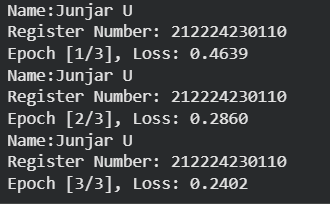
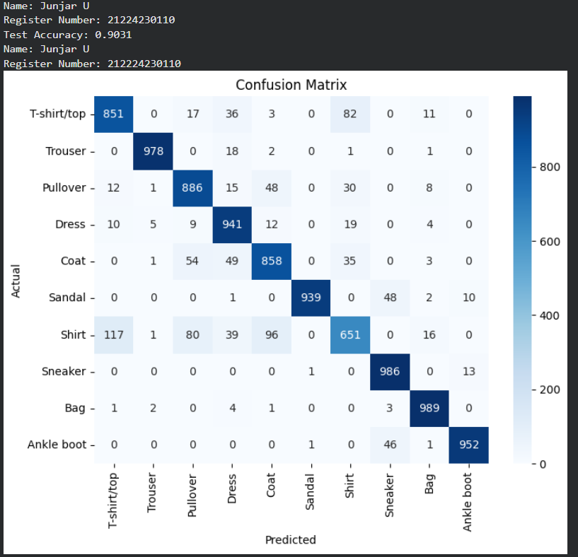
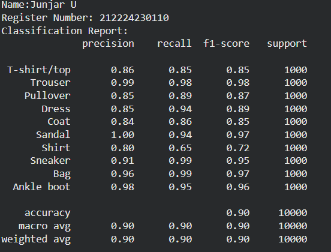
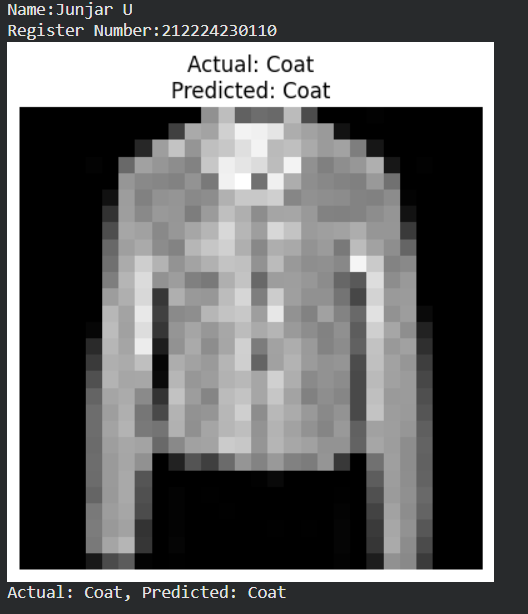

# Develop a Convolutional Deep Neural Network for Image Classification

## AIM
To develop a convolutional deep neural network (CNN) for image classification and to verify the response for new images.

##   PROBLEM STATEMENT AND DATASET
The problem is to design and develop a Convolutional Deep Neural Network (CNN) that can automatically classify grayscale images into predefined categories. The model must learn important spatial features such as edges, textures, and shapes from image data and accurately predict the correct class label.

## Neural Network Model


## DESIGN STEPS
### STEP 1: 

oad the Fashion-MNIST dataset and apply tensor conversion and normalization. Create DataLoaders for training and testing with batch size 32.

### STEP 2: 

Build a CNN with three convolution layers, max-pooling, and three fully connected layers. Use ReLU activation and output 10 classes.

### STEP 3: 

Define CrossEntropyLoss as the loss function. Use Adam optimizer with learning rate 0.001.

### STEP 4: 

Perform forward pass, compute loss, backpropagate, and update weights. Repeat for specified epochs and print training loss.


### STEP 5: 

Switch to evaluation mode and calculate test accuracy. Generate confusion matrix and classification report.


### STEP 6: 

Select a test image and perform forward pass. Display actual and predicted class labels with the image.

## PROGRAM

### Name: Junjar U

### Register Number: 212224230110

```python
class CNNClassifier(nn.Module):
    def __init__(self):
        super(CNNClassifier, self).__init__()
        # write your code here
        self.conv1=nn.Conv2d(in_channels=1,out_channels=32,kernel_size=3,padding=1)
        self.conv2=nn.Conv2d(in_channels=32,out_channels=64,kernel_size=3,padding=1)
        self.conv3=nn.Conv2d(in_channels=64,out_channels=128,kernel_size=3,padding=1)
        self.pool=nn.MaxPool2d(kernel_size=2,stride=2)
        self.fc1=nn.Linear(128*3*3,128)
        self.fc2=nn.Linear(128,64)
        self.fc3=nn.Linear(64,10)


    def forward(self, x):
        # write your code here
        x=self.pool(torch.relu(self.conv1(x)))
        x=self.pool(torch.relu(self.conv2(x)))
        x=self.pool(torch.relu(self.conv3(x)))
        x=x.view(x.size(0),-1)
        x=torch.relu(self.fc1(x))
        x=torch.relu(self.fc2(x))
        x=self.fc3(x)

        return x


# Initialize the Model, Loss Function, and Optimizer
model = CNNClassifier()
criterion =nn.CrossEntropyLoss()
optimizer = optim.Adam(model.parameters(),lr=0.001)

# Train the Model
## Step 3: Train the Model
def train_model(model, train_loader, num_epochs=3):
  for epoch in range(num_epochs):
    model.train()
    running_loss = 0.0
    for images,labels in train_loader:
      optimizer.zero_grad()
      outputs = model(images)
      loss=criterion(outputs,labels)
      loss.backward()
      optimizer.step()
      running_loss+=loss.item()
    print('Name:Junjar U')
    print('Register Number: 212224230110')
    print(f'Epoch [{epoch+1}/{num_epochs}], Loss: {running_loss/len(train_loader):.4f}')

```

### OUTPUT

## Training Loss per Epoch

Include the Training Loss per epoch


## Confusion Matrix

Include confusion matrix here


## Classification Report
Include classification report here


### New Sample Data Prediction
Include your sample input and output here

## RESULT
Thus , the CNN model accurately classifies Fashion-MNISt images into 10 categories
